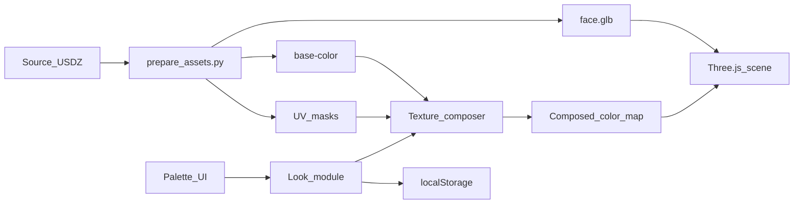

# Windows Local Makeup Palette MVP — Product Requirements

Status: Ready for implementation; no Windows application code is committed on this branch yet.

This document defines the **Windows-local MVP** used to exercise the same makeup-station behavior as [PRD.md](PRD.md) without Xcode, Bitrig, or an iPhone Duo. It is a development and validation product, not a second shipped consumer app.

Parent document: [PRD.md](PRD.md) (iPhone Duo native face-preview requirements). Where this file is silent, inherit product intent from the parent. Where they conflict, **this file wins for the Windows MVP only**.

## 1. Objective

Build a **local web app** that runs on Windows in a desktop browser and lets a single user:

1. Load the prepared bundled 3D face (no live camera).
2. Select category → treatment → color (and intensity).
3. See makeup applied on the correct facial regions.
4. Drag to rotate the model and reset to Front.
5. Clear one treatment, reset all, and compare Before/After without losing the edit.
6. Automatically restore the latest look after a refresh.

The first version must feel like a **full makeup station** with every treatment listed in the parent PRD §4. Realistic finishes and freehand painting remain stretch features.

### Why this exists

| Goal | Windows MVP role |
|---|---|
| Validate masks, blend order, and look JSON on the real UV atlas | Primary |
| Exercise the full treatment station without a Mac | Primary |
| Prove RealityKit / SwiftUI / Duo fold behavior | Out of scope (parent PRD / Mac only) |
| Ship a Windows store app or separate consumer product | Out of scope |

## 2. Agreed scope

| Decision | Requirement |
|---|---|
| Delivery | Local web app opened in a desktop browser on Windows |
| Stack | Vite or equivalent static/dev server + Three.js (WebGL) for the 3D view |
| Face input | Prepared working assets derived from the supplied portrait (GLB + base color + UV masks), not a live camera |
| Camera | No camera permission; no webcam capture |
| Application method | Select treatment, then tap/click a color swatch to apply |
| Coverage | Full station: complexion, cheeks, contour, highlight, eyes, brows, lips, lashes (same treatment set as parent §4) |
| Paired features | Both sides update together |
| Movement | Drag to rotate; useful front and three-quarter views; Front reset |
| Layout stand-in for Duo fold | Face + palette split when “open”; palette hidden when “closed”; no hinge APIs |
| Persistence | Latest look saved in browser `localStorage` (or equivalent local store) and restored on load |
| Integration | In-page module API mirroring the parent receiving contract; no network receiver |
| Relationship to native | Share treatment identifiers, look JSON shape, color/intensity conventions, and prepared masks; do **not** claim shared RealityKit code |
| Deadline | None specified |

### Locked stack choices

- **Renderer:** Three.js loading a prepared `face.glb` (or equivalent glTF) with a replaceable color map.
- **Makeup composition:** CPU (or worker) texture compositing that blends treatment colors through UV-space masks onto the diffuse map, then uploads the result to the GPU. Screen-space stickers that do not rotate with the mesh are unacceptable.
- **Look logic:** A portable module that mirrors `MakeupCore` identifiers, validation, and look JSON `version: 1`, even if implemented in JavaScript for the browser.
- **Asset prep:** Continue using / extending `scripts/prepare_assets.py` (or documented successors) to produce Windows-consumable assets from the source USDZ without modifying the original file.

## 3. Experience and layout

There is no folding phone. Map Duo states to a **compact metaphor** in a single window:

| Compact state | Face preview | Makeup palette |
|---|---|---|
| Closed | Fills the window; remains rotatable | Hidden |
| Open (default) | Left (or top on narrow viewports) | Right (or bottom on narrow viewports) |

- Default launch state is **Open** so palette editing is immediately available for local testing.
- A single control toggles Closed ↔ Open (for example “Hide palette” / “Show palette”). Toggling must preserve applied makeup, viewing angle, selected treatment, and intensity.
- Do not infer open/closed from window aspect ratio alone; use explicit compact state.
- Exact panel proportions and transition animation are implementation choices.
- Left/right swapping and independent left/right makeup editing remain out of scope.

### Main interaction

1. Launch into the restored look, or the prepared model’s original appearance if nothing is saved.
2. With the compact Open, select a category and treatment (for example Eyes → Eyeshadow).
3. Click a color and adjust intensity. Only that treatment updates.
4. Drag the face to inspect. Front returns to the reference angle without removing makeup.
5. Clear one treatment, Reset all, or toggle Before/After.
6. Close the compact (hide palette) or resize the window; continue from the same look and angle.

Required controls:

- Category → treatment → color organization
- Intensity (0–1)
- Clear treatment
- Reset all
- Front
- Accessible Before/After toggle (temporarily hides added makeup; must not erase or overwrite the saved/edited look)
- Compact open/close toggle

## 4. Makeup treatments

Use the same treatment breakdown as parent PRD §4. Stable identifiers must match `MakeupCore.Treatment` raw values:

| Category | Treatment IDs |
|---|---|
| Complexion | `foundation`, `concealer` |
| Cheeks | `blush`, `bronzer` |
| Contour | `cheekContour`, `noseContour`, `jawContour`, `templeContour` |
| Highlight | `cheekHighlight`, `noseHighlight`, `cupidBowHighlight` |
| Eyes | `eyeshadow`, `eyeliner` |
| Brows | `browFill` |
| Lips | `lipstick`, `lipLiner` |
| Lashes | `mascara` |

Rules carried from the parent:

- Each treatment has independent color and intensity.
- Selecting a new color **replaces** that treatment’s setting; repeated identical swatch taps must not accumulate pigment.
- Compositing order is deterministic (declaration / enum order), independent of edit order.
- Masks follow the face surface through rotation.
- Soft treatments need feathered edges; eyeliner and lip liner need defined boundaries.
- Do not tint eyeballs, teeth, mouth interior, or hair where masks exclude them.
- First-version bar: recognizable placement and color that preserves visible skin detail—not physically accurate cosmetics.

## 5. Assets

### Inputs

- Source portrait USDZ supplied for the iPhone work (read-only; never overwrite).
- Working derivatives for Windows:
  - Normalized mesh as glTF/GLB with matching UVs
  - Base color texture (JPEG/PNG atlas)
  - Per-treatment UV masks (same resolution as the working color map)
  - Optional front-reference image for mask QA

### Observations inherited from parent §5

The source UV atlas is multi-piece; masks require model-aware preparation. Mesh piece count must not be assumed to map to facial features. No skeletal rig or facial animation is required for MVP rotation.

### Preparation pipeline

- Document how to regenerate Windows assets from the source USDZ.
- Fail loudly in the UI if the GLB, base color, or any required mask is missing or size-mismatched.
- Preserve the original USDZ; all conversion lives in derived paths (for example under `preview/public/` or `Sources/MakeupFace/Resources/` with a documented copy step).

## 6. Ownership (Windows MVP)

This MVP is owned by the **face-preview / local validation** track. The teammate’s finished Duo palette shell is not required to run Windows.

| Component | Windows MVP owner |
|---|---|
| Asset preparation script and masks | Own |
| Look model, validation, persistence | Own |
| Texture composition | Own |
| Three.js preview, drag rotation, Front | Own |
| Minimal but complete palette UI for all treatments | Own |
| Module API used by the palette | Own |
| Native Swift / RealityKit / Duo fold | Not part of this MVP; parent PRD |

Handoff value back to iPhone work: confirmed treatment IDs, look JSON fixtures, mask set, blend expectations, and recorded Windows acceptance results. Native rendering still needs a separate Mac/simulator checkpoint per parent §8.

## 7. Receiving API contract (in-page)

Mirror the parent §7 operations as an in-process module (TypeScript or JavaScript). Exact function names may differ from Swift; behaviors must match.

| Operation | Required behavior |
|---|---|
| Read supported treatments | Stable IDs + categories + display names |
| Read current look | Color/intensity map so controls reflect restored state |
| Set makeup | Treatment ID + normalized sRGB color + intensity 0–1; replace that treatment; update preview |
| Clear treatment | Remove only that treatment; persist |
| Reset all | Clear all treatments; restore original appearance; persist |
| Show original / show edited | Temporary comparison; do not mutate or save over the edited look |
| Reset view | Front orientation only |
| Compact open / close | Toggle palette visibility without resetting face state |
| Observe status | `loading` \| `ready` \| actionable `failed` |

Validation and safety:

- Reject unsupported treatments, non-finite numbers, and out-of-range colors/intensities without corrupting the current look.
- Single authoritative look state feeds palette, renderer, and persistence.
- Keep orientation transient across compact toggles and window resizes; only makeup settings must survive reload.
- On compose/upload failure, keep the previous valid look visible and surface an error.

### Look JSON (shared with native)

```json
{
  "version": 1,
  "treatments": {
    "lipstick": {
      "color": { "red": 0.72, "green": 0.18, "blue": 0.28 },
      "intensity": 0.85
    }
  }
}
```

Keys are `Treatment` raw values. Unknown keys or bad values must fail restore validation without crashing the app; show the original face and leave the bad file/store untouched until the user successfully edits or resets.

## 8. Architecture sketch



Prototype-only pieces (Three.js materials, browser storage, Vite server) must be labeled as Windows/preview code in the tree. Shared contracts are treatment IDs, look JSON, masks, and blend behavior—not the renderer.

## 9. Persistence, accessibility, and failure behavior

- Persist the latest **valid** look locally; never bake edits into the source USDZ or base texture file on disk.
- Clear / Reset all update persistence so cleared makeup does not return after refresh.
- Missing look → original appearance. Invalid look → original appearance + warning; do not treat as successful restore.
- Before/After does not write persistence.
- Accessible names for treatments and swatches; do not rely on color alone. Intensity must be an accessible control.
- Pair drag rotation with Front reset (and keyboard-friendly alternatives where practical).
- Loading and failure states must be visible. No camera prompt on this path.

## 10. Acceptance criteria

| ID | Pass condition |
|---|---|
| WIN-01 | App runs locally on Windows in a desktop browser with no camera permission. |
| WIN-02 | Prepared model loads with recognizable source appearance. |
| WIN-03 | Drag rotates through front/three-quarter views; Front restores reference orientation without changing makeup. |
| WIN-04 | Every first-version treatment visibly affects its intended region. |
| WIN-05 | Masks avoid excluded features; paired regions update together; makeup stays attached while rotating. |
| WIN-06 | Color/intensity changes preserve other treatments; identical commands are idempotent. |
| WIN-07 | Clear removes one effect; Reset all restores source appearance; Before/After preserves the edit. |
| WIN-08 | Latest look survives refresh; cleared/reset stays cleared/reset. |
| WIN-09 | Invalid API/store inputs leave the previous valid state intact and expose failure. |
| WIN-10 | Compact closed shows face only (rotatable); open shows face + palette; toggling preserves look, angle, and selection. |
| WIN-11 | Look JSON and treatment IDs are compatible with native `MakeupCore` fixtures (round-trip a shared sample look). |
| WIN-12 | Windows acceptance is recorded separately from Mac/simulator RealityKit validation. |

No frame-rate target is set. Prefer responsive rotation and color updates on a typical Windows laptop; reduce working texture resolution only if measured need requires it, and document the tradeoff.

Automated checks should cover look replace/clear/reset, invalid input, and restore. Visual mask/placement checks remain manual (or screenshot-assisted) in the browser.

## 11. Stretch and exclusions

Stretch (after baseline works):

- Worker-thread composition for large atlases
- Named saved looks / export-import JSON
- Closer visual parity tuning against the native RealityKit preview
- Realistic finishes (matte/gloss, shimmer) and freehand painting

Out of scope for this MVP:

- Live camera or face tracking
- Arbitrary model upload / multi-face adaptation
- Electron/Tauri packaging (browser + local server is enough)
- Shipped Windows store / MSI product
- Network API, accounts, cloud sync, sharing
- Duo hinge APIs, SwiftUI shell, RealityKit materials
- Independent left/right makeup editing

## 12. Implementation sequencing

1. Asset pipeline: produce GLB + base color + at least one treatment mask (lipstick) and load in Three.js with drag + Front.
2. Look module + local persistence + set/clear/reset/compare API.
3. Texture composer wired to the color map; prove lipstick on the rotating model.
4. Full palette UI for all treatments; remaining masks.
5. Compact open/close layout; accessibility pass; shared JSON fixture test against `MakeupCore` expectations.
6. Record Windows acceptance results; list any mask or blend deltas the Mac checkpoint must re-verify.

## 13. Relationship to existing repo work

- Parent product requirements remain in [PRD.md](PRD.md).
- Swift packages (`MakeupCore`, `MakeupFace`) remain the native source of truth for iPhone integration.
- Uncommitted or preview-tree experiments on other branches may be reused only if they match this PRD; this document is the acceptance bar, not any prior prototype.
- Do not treat a green Windows MVP as proof that RealityKit import, materials, or Duo layout work on device.

## 14. Research / reference pointers

- Parent [PRD.md](PRD.md) §§4–10 for treatments, API intent, and native acceptance.
- [Three.js](https://threejs.org/docs/) — glTF loading, texture maps, orbit/drag controls.
- OpenUSD / `scripts/prepare_assets.py` — read-only inspection and working-asset generation from the supplied USDZ.
- Charlotte Tilbury category references in parent §13 — station naming only, not required product shades.
